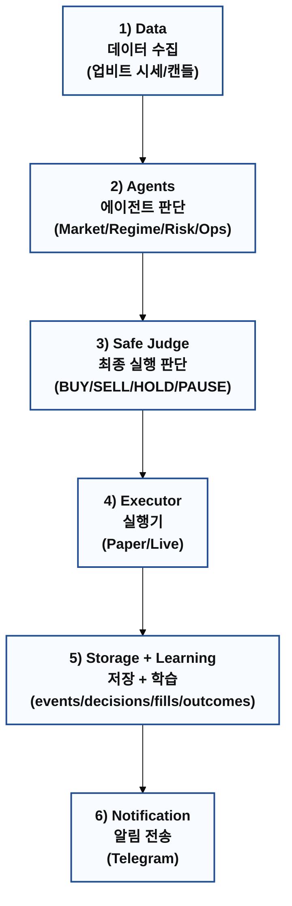
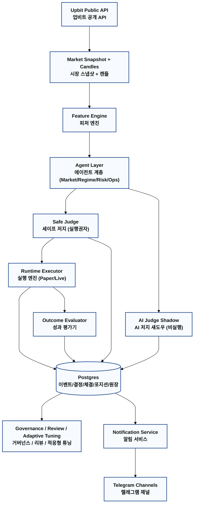

# AI Invest Runtime README

이 문서는 현재 코드베이스 기준으로 자동매매 시스템의 전체 워크플로우를 정리한 운영 문서입니다.

## 1. 목적과 운영 원칙
- 목적: 단기 성능보다 시스템 생존성과 재현 가능한 의사결정(Traceability)을 우선
- 실행권: `Safe Judge`만 최종 실행(BUY/SELL/HOLD/PAUSE) 권한 보유
- AI 역할: 제안/리서치/Shadow 평가 중심, 직접 체결 금지
- 저장 원칙: 의사결정/체결/복기/알림을 이벤트 + 테이블로 모두 기록

## 2. 전체 구조

먼저 한 줄로 보면 아래입니다.

1. 시장 데이터 수집
2. 에이전트가 신호/리스크 판단
3. Safe Judge가 최종 실행 여부 결정
4. 주문/체결/손익을 저장하고 다음 개선에 재사용

### 2.1 한눈 버전 (요약)


### 2.2 상세 버전


## 3. 오케스트레이터 역할
메인 워커 관리자는 `scripts/run_multi_orchestrator.py`입니다.

- 역할:
1. 워커 프로세스 생성/감시
2. 비정상 종료 워커 자동 재기동
3. 상태 스냅샷 `runtime/orchestrator_status.json` 기록
4. SIGTERM/SIGINT 시 전체 워커 정리 종료

기본 워커 토폴로지(현재 `rules.yaml` 기준):

| Worker | Script | 기본 주기 |
|---|---|---|
| runtime loop | `scripts/run_paper_loop.py` (`universe.mode` 기준 paper/live) | 30초 |
| research work | `scripts/run_agent_work_loop.py --agent research` | 2시간 (120분) |
| quant work | `scripts/run_agent_work_loop.py --agent quant` | 2시간 (120분) |
| risk work | `scripts/run_agent_work_loop.py --agent risk` | 2시간 (120분) |
| ops work | `scripts/run_agent_work_loop.py --agent ops` | 2시간 (120분) |
| governance loop | `scripts/run_governance_loop.py` | 30초 |
| review loop | `scripts/run_review_loop.py` | 1분 |
| adaptive tuning loop | `scripts/run_adaptive_tuning_loop.py` | 1시간 (60분) |

## 4. 실시간 매매 워크플로우
실행 엔진의 핵심 루프는 `ai_invest/runtime/paper_loop.py`입니다.

1. 룰/설정 로드(`rules.yaml`)
2. 심볼 선정(활성 Trade Plan + 오픈포지션 + 동적 후보 우선순위)
3. 시장 스냅샷/캔들 수집 및 피처 계산
4. Agent 의견 생성
5. Safe Judge 하드 게이트 평가
6. `SAFE_DECISION` 저장 + 알림 전송
7. 실행 가능 시 Runtime Executor가 주문/체결/원장 반영  
  - `universe.mode=paper` -> `PaperExecutor`  
  - `universe.mode=live` -> `LiveExecutor` + 업비트 private API
8. `FILL` 알림 전송(체결금액/총수수료/수수료율 포함)
9. 포지션 종료 시 Outcome Evaluator가 원인 코드(`OC_*`) 기록
10. AI Judge Shadow 판단 저장(실행 없음)

## 5. Judge 게이트 요약
`ai_invest/judge/safe_judge.py` 기준:

| 게이트 | 조건 | 결과 |
|---|---|---|
| Pause state | `ops.pause_state=true` | `PAUSE` |
| Recon fail | `ops.reconciliation_status=FAIL` | `PAUSE` |
| Rate limit storm | `ops.rate_limit_alert=true` | `PAUSE` |
| Daily loss limit | `daily_loss_pct >= max_daily_loss_pct` | `PAUSE` |
| Ops veto | `ops.veto=true` | `PAUSE` |
| Regime blocked | `regime.trade_allowed=false` | `HOLD` |
| Risk veto | `risk.veto=true` | `HOLD` |
| Spread over limit | `spread_bps > max_spread_bps_entry` | `HOLD` |

## 6. 실행/수수료 계산
`ai_invest/execution/paper_execution.py` / `ai_invest/execution/live_execution.py` 기준:

- 체결 수수료:
`fee = fill_price * qty * (fee_bps / 10000)`
- 기본 수수료율:
`fallback_bid_fee_bps=5.0`, `fallback_ask_fee_bps=5.0` (0.05%)
- 체결 알림(`tpl_fill_notice`)에 포함:
1. 체결 수량
2. 체결 가격
3. 수수료 금액
4. 수수료율(`%`, `bps`)
5. 총 체결 금액
6. 총 수수료

## 7. Agent 구조 요약
`agents.md`의 계약을 런타임에 반영합니다.

| 계층 | 컴포넌트 | 책임 |
|---|---|---|
| Runtime Agents | Market / Regime / Risk / Ops | 신호, 레짐, 리스크, 운영 상태 평가 |
| Judge | Safe Judge | 최종 실행 의사결정 |
| Judge | AI Judge | Shadow 판단/비교 |
| Learning | Outcome Evaluator | 종료 거래 평가(`WIN/LOSS/FLAT/MISS`, `OC_*`) |
| Governance | Strategy Coordinator | 주간 우선순위/실험 제안 |
| Finance | Finance/Tax Agent | 월말 정산/정합성 검증 |
| Research | Research Agent | 일일 브리프/리스크 워치 |

## 8. 저장 구조(핵심 테이블/이벤트)
주요 저장소는 Postgres(`ai_invest/storage/postgres.py`)입니다.

- 핵심 테이블:
1. `events`
2. `decisions`
3. `agent_opinions`
4. `orders`
5. `fills`
6. `positions`
7. `execution_metrics`
8. `ledger_entries`
9. `decision_outcomes`
10. `notification_deliveries`
11. `pnl_daily`

- 주요 이벤트 타입:
`MARKET_SNAPSHOT`, `AGENT_OPINION`, `SAFE_DECISION`, `AI_DECISION`, `ORDER_SUBMITTED`, `FILL`, `PAUSE`, `RESUME`, `DECISION_OUTCOME_RECORDED`

## 9. 알림 흐름
`ai_invest/notifications/service.py` + `ai_invest/notifications/templates.py`

1. 도메인 이벤트 발생
2. 템플릿 렌더(`tpl_safe_decision`, `tpl_fill_notice` 등)
3. 채널별 전송(Telegram)
4. 성공/실패/중복제거 결과를 `notification_deliveries`에 저장

## 10. 실행/재시작 가이드
API 서버(개발):

```bash
uv run uvicorn app.main:app --host 0.0.0.0 --port 8000 --reload
```

오케스트레이터 단독 실행:

```bash
.venv/bin/python3 scripts/run_multi_orchestrator.py
```

라이브 루프 단독 실행:

```bash
ENABLE_LIVE_TRADING=true .venv/bin/python3 scripts/run_live_loop.py --cycles 1000000000 --sleep-sec 30
```

오케스트레이터 재시작(수동):

```bash
pkill -TERM -f "scripts/run_multi_orchestrator.py" || true
sleep 1
setsid .venv/bin/python3 scripts/run_multi_orchestrator.py > runtime/orchestrator.log 2>&1 < /dev/null &
```

참고:
- FastAPI는 부팅 시 `orchestrator_autostart`를 통해 오케스트레이터 자동 기동 가능
- 상태 파일: `runtime/orchestrator_status.json`

## 11. 핵심 설정 파일
- 매매/리스크/비용/주기: `rules.yaml`
- 원인 코드 표준: `reason_codes.md`
- 주문 상태 전이: `order_state_machine.md`
- 운영/알림 규칙: `ops_runbook.md`, `notifications_telegram.md`

## 12. 디렉토리 맵
| 경로 | 설명 |
|---|---|
| `ai_invest/runtime/` | 실시간 루프, 오케스트레이션, 포지션 상태 |
| `ai_invest/agents/` | Runtime Agent 로직 |
| `ai_invest/judge/` | Safe/AI Judge |
| `ai_invest/execution/` | Paper/Live 실행 엔진, 상태머신, 업비트 private 클라이언트 |
| `ai_invest/learning/` | Outcome 평가 및 학습 루프 |
| `ai_invest/notifications/` | 템플릿, 전송, 이력 기록 |
| `ai_invest/storage/` | Postgres Repository |
| `scripts/` | 워커 실행 엔트리포인트 |
| `app/` | FastAPI 서버/UI API |
